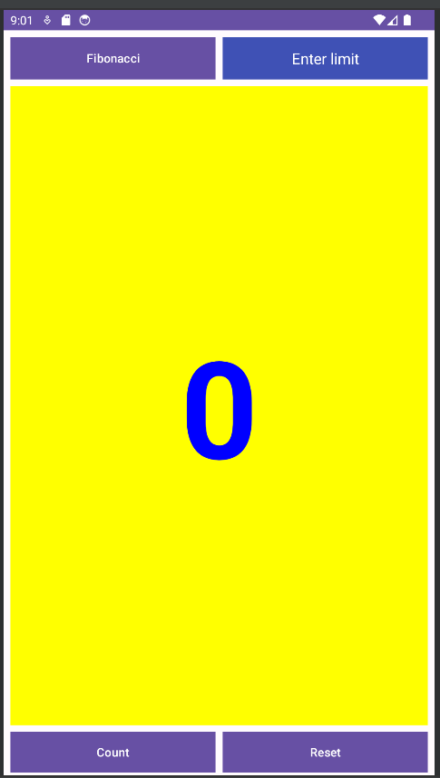

# **Hello App TI22A2**
```
Nama    : Risji probo sadewo
NIM     : 312210191
Kelas   : TI.22.A.2
Matkul  : Pemrograman Mobile 1
```
## **Daftar isi**
**[Program Fibonacci](#program-fibonacci)**                
**- [MainActivity.java](#mainactivityjava)**           
**- [strings.xml](#stringsxml)**           
**- [colors.xml](#colorsxml)**         
**- [MainActivity.java](#activity_mainxml)**            
**[Desain Application](#desain-application)**           
**[Demo Application](#demo-application)**

## **Program Fibonacci**
### **MainActivity.java**
```java
package androidx.constraintlayout.widget.fibonacciapp;

import androidx.appcompat.app.AppCompatActivity;
import androidx.core.content.ContextCompat;

import android.os.Bundle;
import android.widget.TextView;
import android.view.View;
import android.widget.Toast;
import android.widget.EditText;

public class MainActivity extends AppCompatActivity {

    private long fibMinus1 = 0;
    private long fibMinus2 = 1;
    private long currentFib = 0;
    private TextView mShowFibonacci;
    private long i = 0;

    private long n = 0;
    private long limit = 0; // Menyimpan batas Fibonacci yang diinginkan

    private EditText mLimitInput;

    @Override
    protected void onCreate(Bundle savedInstanceState) {
        super.onCreate(savedInstanceState);
        setContentView(R.layout.activity_main);
        mShowFibonacci = (TextView) findViewById(R.id.show_count);
        mLimitInput = (EditText) findViewById(R.id.limit_input);
        updateFibonacciDisplay();
    }

    public void countUp(View view) {
        if (mLimitInput.getText().toString().isEmpty()) {
            Toast.makeText(this, "Enter the limit first", Toast.LENGTH_SHORT).show();
            return;
        }

        limit = Long.parseLong(mLimitInput.getText().toString());

        if (n >= limit) {
            Toast.makeText(this, "Fibonacci limit reached", Toast.LENGTH_SHORT).show();
            return; // Hentikan perhitungan jika jumlah baris Fibonacci mencapai batas
        }

        long newFib = fibMinus1 + fibMinus2;
        fibMinus2 = fibMinus1;
        fibMinus1 = newFib;
        currentFib = newFib;
        n++; // Inkrementasi jumlah baris Fibonacci

        updateFibonacciDisplay();
    }


    public void showFibonacci(View view) {
        Toast toast = Toast.makeText(this, R.string.fibonacci_message, Toast.LENGTH_SHORT);
        toast.show();
    }

    public void reset(View view) {
        currentFib = 0;
        fibMinus2 = 1;
        fibMinus1 = 0;
        limit = 0;
        n = 0;
        mLimitInput.setText(""); // Mengosongkan input
        updateFibonacciDisplay();
    }

    private void updateFibonacciDisplay() {
        if (mShowFibonacci != null) {
            mShowFibonacci.setText(Long.toString(currentFib));
            mShowFibonacci.setTextColor(getFibonacciColor());
        }
    }

    private int getFibonacciColor() {
        // Gantilah warna berdasarkan nilai Fibonacci
        i++;
        if (i % 2 == 0) {
            return ContextCompat.getColor(this, R.color.colorFibonacciBlue);
        } else {
            return ContextCompat.getColor(this, R.color.colorFibonacciGreen);
        }
    }
}
```

Program diatas adalah aplikasi Android sederhana yang menghitung barisan Fibonacci dengan beberapa fitur tambahan. Berikut sedikit penjelasan dari program tersebut:

1. **Variabel-variabel**:
   - `fibMinus1`, `fibMinus2`, dan `currentFib`: Variabel-variabel ini digunakan untuk menyimpan nilai-nilai dalam barisan Fibonacci. `fibMinus1` menyimpan nilai Fibonacci sebelumnya, `fibMinus2` menyimpan nilai dua langkah sebelumnya, dan `currentFib` menyimpan nilai Fibonacci saat ini.
   - `mShowFibonacci`: Merupakan elemen UI TextView yang digunakan untuk menampilkan nilai Fibonacci saat ini.
   - `i`: Variabel ini digunakan untuk menghitung jumlah langkah dalam perhitungan Fibonacci.
   - `n`: Variabel ini digunakan untuk menghitung jumlah baris Fibonacci yang telah dihitung.
   - `limit`: Variabel ini digunakan untuk menyimpan batas Fibonacci yang diinginkan oleh pengguna.
   - `mLimitInput`: Merupakan elemen UI EditText yang digunakan untuk memasukkan batas Fibonacci.

2. **onCreate()**: Metode ini dipanggil saat aktivitas dimulai. Di sini, elemen-elemen UI diinisialisasi, dan `updateFibonacciDisplay()` dipanggil untuk menampilkan nilai Fibonacci awal (biasanya 0).

3. **countUp(View view)**: Metode ini dipanggil saat tombol "Count" diklik. Fungsinya adalah untuk menghitung nilai berikutnya dalam barisan Fibonacci.
   - Pertama, kode memeriksa apakah `mLimitInput` tidak kosong. Jika kosong, program akan menampilkan pesan kesalahan.
   - Kemudian, nilai dari `mLimitInput` diambil dan disimpan dalam variabel `limit`.
   - Program akan menambahkan `n` untuk menghitung jumlah baris Fibonacci yang telah dihitung.
   - Selanjutnya, program akan menghitung nilai Fibonacci berikutnya dan memperbarui `fibMinus1`, `fibMinus2`, dan `currentFib`.
   - Jika jumlah baris Fibonacci mencapai batas (`n >= limit`), program akan menghentikan perhitungan dan menampilkan pesan "Fibonacci limit reached."
   - Terakhir, tampilan nilai Fibonacci diperbarui.

4. **showFibonacci(View view)**: Metode ini dipanggil saat tombol "Show Fibonacci" diklik. Ini akan menampilkan pesan popup (Toast) yang berisi pesan "Hello Fibonacci!"

5. **reset(View view)**: Metode ini dipanggil saat tombol "Reset" diklik. Ini akan mengatur semua variabel ke nilai awal dan mengosongkan input batas.

6. **updateFibonacciDisplay()**: Metode ini digunakan untuk mengubah tampilan nilai Fibonacci saat ini pada elemen `mShowFibonacci`. Ini juga mengatur warna latar belakang elemen berdasarkan nilai Fibonacci.

7. **getFibonacciColor()**: Metode ini digunakan untuk mengganti warna latar belakang elemen berdasarkan nilai Fibonacci saat ini. Pada dasarnya, jika `i` adalah bilangan genap, maka warna latar belakang akan biru, dan jika `i` adalah bilangan ganjil, maka warna latar belakang akan hijau.

Program ini memberikan pengguna kemampuan untuk menghitung barisan Fibonacci dengan memasukkan batas tertentu dan juga memiliki fitur "Show Fibonacci" untuk menampilkan pesan popup. Selain itu, ada pula fitur "Reset" untuk mengatur ulang perhitungan. Program juga mengubah warna latar belakang elemen saat menghitung Fibonacci.


### **strings.xml**
```xml
<resources>
    <string name="app_name">FibonacciApp</string>
    <string name="button_label_count">Count</string>
    <string name="button_label_fibonacci">Fibonacci</string>
    <string name="fibonacci_message">Program Fibonacci</string>
</resources>
```

<hr>

### **colors.xml**
```xml
<?xml version="1.0" encoding="utf-8"?>
<resources>
    <color name="black">#FF000000</color>
    <color name="white">#FFFFFFFF</color>
    <color name="blue">#0000FF</color>
    <color name="colorPrimary">#3F51B5</color>
    <color name="colorPrimaryDark">#303F9F</color>
    <color name="colorAccent">#FF4081</color>
    <color name="colorNumber">#69BE28</color>
    <color name="colorFibonacciBlue">#0000FF</color> <!-- Biru -->
    <color name="colorFibonacciGreen">#008000</color> <!-- Hijau -->
</resources>
```

<hr>

### **activity_main.xml**
```xml
<?xml version="1.0" encoding="utf-8"?>
<androidx.constraintlayout.widget.ConstraintLayout
    xmlns:android="http://schemas.android.com/apk/res/android"
    xmlns:app="http://schemas.android.com/apk/res-auto"
    xmlns:tools="http://schemas.android.com/tools"
    android:layout_width="match_parent"
    android:layout_height="match_parent"
    tools:context=".MainActivity">


    <Button
        android:id="@+id/button_fibonacci"
        android:layout_width="242dp"
        android:layout_height="50dp"
        android:layout_marginEnd="8dp"
        android:layout_marginStart="8dp"
        android:layout_marginTop="8dp"
        android:background="@color/colorPrimary"
        android:onClick="showFibonacci"
        android:text="@string/button_label_fibonacci"
        android:textColor="@android:color/white"
        app:layout_constraintEnd_toEndOf="parent"
        app:layout_constraintStart_toStartOf="parent"
        app:layout_constraintHorizontal_bias="0.0"
        app:layout_constraintTop_toTopOf="parent"
        tools:ignore="OnClick" />

    <EditText
        android:id="@+id/limit_input"
        android:layout_width="242dp"
        android:layout_height="50dp"
        android:layout_marginStart="8dp"
        android:layout_marginTop="8dp"
        android:layout_marginEnd="8dp"
        android:background="@color/colorPrimary"
        android:textAlignment="center"
        android:textColor="@color/white"
        android:hint="Enter limit"
        android:textColorHint="@color/white"
        android:inputType="number"
        app:layout_constraintEnd_toEndOf="parent"
        app:layout_constraintHorizontal_bias="1.0"
        app:layout_constraintStart_toStartOf="parent"
        app:layout_constraintTop_toTopOf="parent" />

    <Button
        android:id="@+id/button_count"
        android:layout_width="242dp"
        android:layout_height="wrap_content"
        android:layout_marginStart="8dp"
        android:layout_marginEnd="8dp"
        android:layout_marginBottom="4dp"
        android:background="@color/colorPrimary"
        android:onClick="countUp"
        android:text="@string/button_label_count"
        android:textColor="@android:color/white"
        app:layout_constraintBottom_toBottomOf="parent"
        app:layout_constraintEnd_toEndOf="parent"
        app:layout_constraintHorizontal_bias="0.0"
        app:layout_constraintStart_toStartOf="parent" />

    <Button
        android:id="@+id/button_reset"
        android:layout_width="242dp"
        android:layout_height="wrap_content"
        android:layout_marginStart="8dp"
        android:layout_marginEnd="8dp"
        android:layout_marginBottom="4dp"
        android:background="@color/colorPrimary"
        android:onClick="reset"
        android:text="Reset"
        android:textColor="@android:color/white"
        app:layout_constraintBottom_toBottomOf="parent"
        app:layout_constraintEnd_toEndOf="parent"
        app:layout_constraintHorizontal_bias="1.0"
        app:layout_constraintStart_toStartOf="parent"
        tools:ignore="OnClick" />

    <TextView
        android:id="@+id/show_count"
        android:layout_width="0dp"
        android:layout_height="0dp"
        android:layout_marginStart="8dp"
        android:layout_marginTop="8dp"
        android:layout_marginEnd="8dp"
        android:layout_marginBottom="8dp"
        android:background="#FFFF00"
        android:gravity="center_vertical"
        android:text="0"
        android:textAlignment="center"
        android:textColor="@color/colorPrimary"
        android:textSize="160sp"
        android:textStyle="bold"
        app:layout_constraintBottom_toTopOf="@+id/button_count"
        app:layout_constraintEnd_toEndOf="parent"
        app:layout_constraintHorizontal_bias="0.0"
        app:layout_constraintStart_toStartOf="parent"
        app:layout_constraintTop_toBottomOf="@+id/button_fibonacci"
        app:layout_constraintVertical_bias="0.0"
        tools:ignore="RtlCompat" />


</androidx.constraintlayout.widget.ConstraintLayout>
```

Program ini adalah file layout XML yang digunakan untuk merancang tampilan antarmuka pengguna (UI) dalam aplikasi Android menggunakan XML. Mari saya berikan penjelasan lebih rinci tentang setiap elemen dalam XML ini:

1. **ConstraintLayout**: Ini adalah tata letak (layout) yang digunakan untuk menempatkan elemen-elemen tampilan dalam hubungan relatif satu sama lain.

2. **Button (button_fibonacci)**: Ini adalah tombol yang akan mengaktifkan perhitungan bilangan Fibonacci. Beberapa atribut yang penting di sini:
   - `android:id`: ID unik yang digunakan untuk mengidentifikasi elemen ini.
   - `android:onClick`: Metode yang akan dipanggil saat tombol ditekan.
   - `android:text`: Teks yang ditampilkan pada tombol.
   - `app:layout_constraintEnd_toEndOf` dan `app:layout_constraintStart_toStartOf`: Menentukan posisi horizontal tombol relatif terhadap parent layout.
   - `app:layout_constraintTop_toTopOf`: Menentukan posisi vertikal tombol relatif terhadap parent layout.

3. **EditText (limit_input)**: Ini adalah elemen input teks yang memungkinkan pengguna memasukkan batas untuk perhitungan bilangan Fibonacci. Beberapa atribut yang penting:
   - `android:id`: ID unik.
   - `android:hint`: Teks yang ditampilkan sebagai petunjuk untuk pengguna.
   - `android:inputType`: Jenis input (hanya angka dalam hal ini).

4. **Button (button_count)**: Ini adalah tombol yang digunakan untuk menjalankan perhitungan bilangan Fibonacci. Beberapa atribut yang penting:
   - `android:id`: ID unik.
   - `android:onClick`: Metode yang akan dipanggil saat tombol ditekan.

5. **Button (button_reset)**: Ini adalah tombol untuk mengatur ulang perhitungan bilangan Fibonacci ke kondisi awal. Beberapa atribut yang penting:
   - `android:id`: ID unik.
   - `android:onClick`: Metode yang akan dipanggil saat tombol ditekan.

6. **TextView (show_count)**: Ini adalah elemen teks yang digunakan untuk menampilkan hasil perhitungan bilangan Fibonacci. Beberapa atribut yang penting:
   - `android:id`: ID unik.
   - `android:text`: Teks awal yang ditampilkan (0 dalam hal ini).
   - `app:layout_constraintBottom_toTopOf`, `app:layout_constraintEnd_toEndOf`, `app:layout_constraintStart_toStartOf`, dan `app:layout_constraintTop_toBottomOf`: Menentukan tata letak relatif elemen ini terhadap elemen-elemen lainnya.

Selain atribut-atribut yang dijelaskan di atas, terdapat beberapa atribut lain yang digunakan untuk mengatur tampilan dan perilaku elemen-elemen ini dalam tata letak.
<hr>

## **Desain Application**


<hr>

**[Back-->](#hello-app-ti22a2)**
